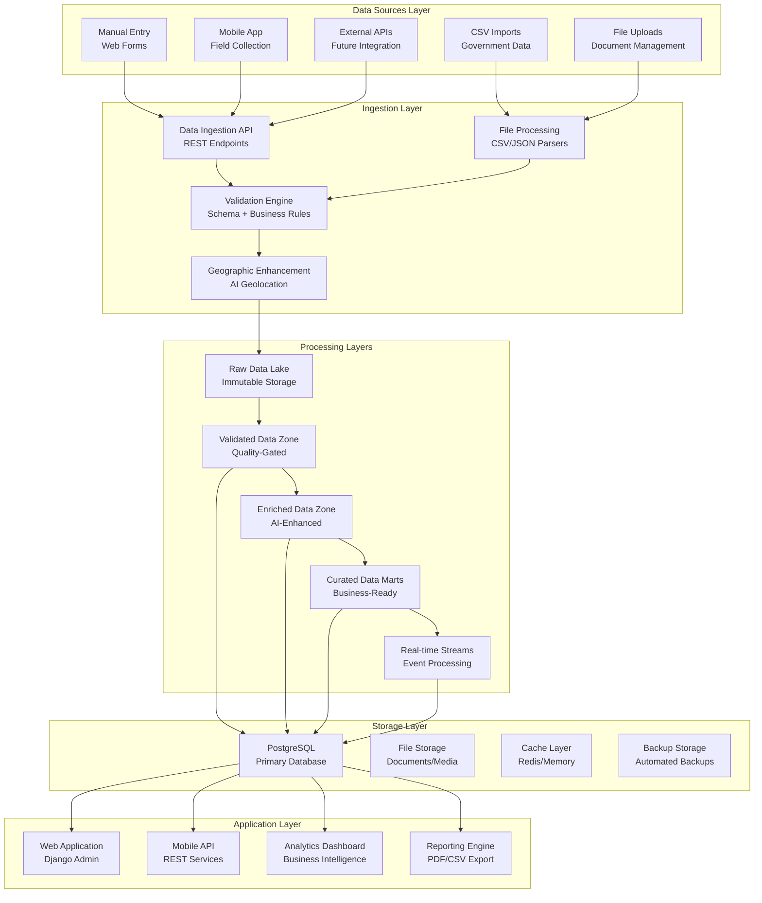

# Comprehensive Data Architecture Plan - GVRC Project
## Enhanced Architecture Beyond Medallion for Free Project

**Document Version:** 1.0  
**Date:** January 2025  
**Project:** GVRC Admin - Multi-Institutional GBV Response Platform  
**Architecture Type:** Enhanced Multi-Layer Data Architecture (Free Project Optimized)

---

## Table of Contents

1. [Executive Summary](#executive-summary)
2. [Current State Analysis](#current-state-analysis)
3. [Enhanced Architecture Overview](#enhanced-architecture-overview)
4. [Data Sources & Integration Strategy](#data-sources--integration-strategy)
5. [Data Processing Layers](#data-processing-layers)
6. [Data Quality & Governance Framework](#data-quality--governance-framework)
7. [Geographic Data Enhancement](#geographic-data-enhancement)
8. [Real-time Data Processing](#real-time-data-processing)
9. [Data Storage & Management](#data-storage--management)
10. [Security & Compliance](#security--compliance)
11. [Monitoring & Observability](#monitoring--observability)
12. [Implementation Roadmap](#implementation-roadmap)
13. [Cost Optimization Strategy](#cost-optimization-strategy)
14. [Future Scalability Plan](#future-scalability-plan)
15. [Technical Implementation Details](#technical-implementation-details)

---

## Executive Summary

This document outlines a comprehensive data architecture plan for the GVRC (Gender-Based Violence Response Center) Admin system that goes beyond traditional medallion architecture while remaining cost-effective for a free project. The architecture is designed to handle 50+ new records daily with AI-powered geolocation enhancement, comprehensive data quality management, and seamless integration of multiple data sources.

### Key Architecture Principles

1. **Multi-Layer Data Architecture** - Beyond traditional bronze/silver/gold medallion
2. **AI-Enhanced Data Processing** - Free geolocation services and data enrichment
3. **Extensible Integration Framework** - Easy addition of new data sources
4. **Cost-Optimized Design** - Free hosting with paid upgrade paths
5. **Data Swarm Prevention** - Intelligent data deduplication and quality gates
6. **Real-time Capabilities** - Near real-time processing within free constraints

### Current State
- **Data Volume:** 80MB total (361 facilities, 18 counties, 19 constituencies, 19 wards)
- **Data Sources:** JSON files, manual entry, basic CSV imports
- **Processing:** Batch processing, manual validation
- **Infrastructure:** Django + PostgreSQL (free tier)

### Target State
- **Data Volume:** 200-500MB (2,000-5,000 facilities)
- **Data Sources:** Multiple integrated sources with automated ingestion
- **Processing:** AI-enhanced, near real-time with quality gates
- **Infrastructure:** Scalable, cost-optimized, production-ready

---

## Current State Analysis

### Data Inventory

#### Current Data Sources
1. **JSON Files (1.4MB total)**
   - Database dumps (Django fixtures format)
   - Initial data fixtures
   - Static configuration files

2. **Database (9MB SQLite + 1.4MB PostgreSQL dump)**
   - 361 facilities
   - 18 counties (incomplete - need 47)
   - 19 constituencies (incomplete - need 290)
   - 19 wards (incomplete - need 1,450)

3. **Static Assets (50MB)**
   - UI components and assets
   - Documentation files
   - Media files (15MB)

4. **Logs (3.7MB)**
   - Application logs
   - ETL processing logs
   - Error logs

#### Data Quality Assessment
- **Completeness:** ~80% for required fields
- **Accuracy:** Manual validation only
- **Consistency:** Basic referential integrity
- **Timeliness:** Manual updates, no real-time processing
- **Geographic Coverage:** Severely incomplete (1.3% of wards covered)

### Current Pain Points

1. **Data Swarm Issues**
   - Inconsistent facility information
   - Duplicate records across sources
   - Manual data entry errors
   - No automated quality validation

2. **Geographic Data Gaps**
   - Missing 28 counties (59% incomplete)
   - Missing 271 constituencies (93% incomplete)
   - Missing 1,431 wards (98.7% incomplete)

3. **Integration Limitations**
   - No external data source connections
   - Manual CSV imports only
   - No real-time data updates
   - Limited mobile data collection

4. **Scalability Constraints**
   - Free hosting limitations
   - Manual processing bottlenecks
   - No automated backup strategies
   - Limited monitoring capabilities

---

## Enhanced Architecture Overview

### Multi-Layer Data Architecture



### Architecture Principles

1. **Data Lake First** - All raw data preserved immutably
2. **Quality Gates** - Multi-layer validation and enrichment
3. **AI Enhancement** - Automated geolocation and data enrichment
4. **Event-Driven** - Real-time processing where possible
5. **Cost-Optimized** - Free hosting with smart resource usage
6. **Extensible** - Easy addition of new data sources and processing layers

---

## Data Sources & Integration Strategy

### Current Data Sources (Immediate)

#### 1. Manual Data Entry
- **Web Forms:** Django admin interface
- **Mobile Forms:** Future mobile app integration
- **Bulk Upload:** CSV/Excel file uploads
- **API Endpoints:** REST API for external integrations

#### 2. Government Data Sources (Free)
- **Kenya Open Data Initiative:** CSV downloads
- **Ministry of Health:** Facility registrations
- **National Police Service:** Station locations
- **County Governments:** Local facility data

#### 3. Community Data Sources
- **NGO Reports:** Partner organization data
- **Community Input:** User-contributed information
- **Field Worker Data:** Mobile collection
- **Volunteer Surveys:** Community mapping

### Future Data Sources (Extensible)

#### 1. Real-time APIs
- **Government APIs:** When available
- **Health Information Systems:** Hospital data
- **Emergency Services:** 911/999 call data
- **Social Services:** Case management systems

#### 2. IoT and Sensor Data
- **Mobile Location Data:** GPS tracking (anonymized)
- **Emergency Beacons:** Panic button data
- **Traffic Data:** Route optimization
- **Weather Data:** Emergency planning

#### 3. External Databases
- **UNHCR Data:** Refugee facility information
- **WHO Data:** Global health facility data
- **Red Cross Data:** Emergency response facilities
- **Private Sector:** Corporate social responsibility data

### Integration Framework

```python
# Data Source Integration Framework
class DataSourceManager:
    def __init__(self):
        self.sources = {
            'manual': ManualEntrySource(),
            'csv': CSVImportSource(),
            'api': APIIntegrationSource(),
            'mobile': MobileAppSource(),
            'external': ExternalAPISource()
        }
    
    def register_source(self, name, source_class):
        """Register new data source"""
        self.sources[name] = source_class()
    
    def process_data(self, source_name, data):
        """Process data from any source"""
        source = self.sources.get(source_name)
        if source:
            return source.process(data)
        raise ValueError(f"Unknown source: {source_name}")

# Example: Adding new data source
class WhatsAppIntegrationSource:
    def process(self, data):
        # Process WhatsApp messages for facility updates
        return self.extract_facility_data(data)
```

---

## Data Processing Layers

### Layer 1: Raw Data Lake (Immutable Storage)

**Purpose:** Store all incoming data in its original form for audit and reprocessing

```python
class RawDataLake:
    def __init__(self):
        self.storage_path = "data/raw/"
        self.metadata_db = "raw_data_metadata"
    
    def store_raw_data(self, source, data, metadata):
        """Store raw data with metadata"""
        timestamp = datetime.now().isoformat()
        filename = f"{source}_{timestamp}.json"
        
        # Store data
        with open(f"{self.storage_path}/{filename}", 'w') as f:
            json.dump({
                'data': data,
                'metadata': {
                    'source': source,
                    'timestamp': timestamp,
                    'size': len(str(data)),
                    'checksum': hashlib.md5(str(data).encode()).hexdigest(),
                    **metadata
                }
            }, f)
        
        # Store metadata in database
        self.store_metadata(filename, metadata)
    
    def get_raw_data(self, source, date_range=None):
        """Retrieve raw data for reprocessing"""
        # Implementation for data retrieval
        pass
```

### Layer 2: Validated Data Zone (Quality-Gated)

**Purpose:** Apply schema validation and basic quality checks

```python
class DataValidator:
    def __init__(self):
        self.schemas = {
            'facility': self.get_facility_schema(),
            'geographic': self.get_geographic_schema(),
            'contact': self.get_contact_schema()
        }
    
    def validate_facility_data(self, data):
        """Comprehensive facility data validation"""
        validation_result = {
            'is_valid': True,
            'errors': [],
            'warnings': [],
            'quality_score': 0
        }
        
        # Schema validation
        schema_errors = self.validate_schema(data, 'facility')
        if schema_errors:
            validation_result['errors'].extend(schema_errors)
            validation_result['is_valid'] = False
        
        # Business rules validation
        business_errors = self.validate_business_rules(data)
        if business_errors:
            validation_result['errors'].extend(business_errors)
            validation_result['is_valid'] = False
        
        # Data quality scoring
        validation_result['quality_score'] = self.calculate_quality_score(data)
        
        return validation_result
    
    def validate_business_rules(self, data):
        """Validate business-specific rules"""
        errors = []
        
        # Required fields
        required_fields = ['facility_name', 'location']
        for field in required_fields:
            if not data.get(field):
                errors.append(f"Missing required field: {field}")
        
        # Geographic validation
        if data.get('location'):
            geo_errors = self.validate_geographic_data(data['location'])
            errors.extend(geo_errors)
        
        # Contact validation
        if data.get('contacts'):
            contact_errors = self.validate_contact_data(data['contacts'])
            errors.extend(contact_errors)
        
        return errors
```

### Layer 3: Enriched Data Zone (AI-Enhanced)

**Purpose:** Apply AI enhancements and data enrichment

```python
class DataEnrichmentEngine:
    def __init__(self):
        self.geolocation_service = FreeGeolocationService()
        self.data_enricher = DataEnricher()
        self.duplicate_detector = DuplicateDetector()
    
    def enrich_facility_data(self, validated_data):
        """Apply AI enhancements to facility data"""
        enriched_data = validated_data.copy()
        
        # 1. Geographic Enhancement
        if self.needs_geolocation_enrichment(enriched_data):
            enriched_data = self.enhance_geolocation(enriched_data)
        
        # 2. Data Enrichment
        enriched_data = self.enrich_missing_fields(enriched_data)
        
        # 3. Duplicate Detection
        duplicates = self.detect_duplicates(enriched_data)
        if duplicates:
            enriched_data['duplicate_flags'] = duplicates
        
        # 4. Quality Scoring
        enriched_data['quality_score'] = self.calculate_enhanced_quality_score(enriched_data)
        
        return enriched_data
    
    def enhance_geolocation(self, data):
        """Enhance geographic data using free services"""
        location = data.get('location', {})
        
        # Use free geocoding services
        if location.get('address') and not location.get('coordinates'):
            coords = self.geolocation_service.geocode(
                location['address'],
                country='Kenya'
            )
            if coords:
                location['latitude'] = coords['lat']
                location['longitude'] = coords['lng']
                location['accuracy'] = coords.get('accuracy', 'unknown')
        
        # Enhance county/constituency/ward mapping
        if location.get('county') and not location.get('county_id'):
            county = self.geolocation_service.find_county(location['county'])
            if county:
                location['county_id'] = county['id']
                location['county_code'] = county['code']
        
        data['location'] = location
        return data

class FreeGeolocationService:
    """Free geolocation services for Kenya"""
    
    def __init__(self):
        self.nominatim_url = "https://nominatim.openstreetmap.org/search"
        self.kenya_bounds = {
            'min_lat': -4.7, 'max_lat': 5.5,
            'min_lng': 33.9, 'max_lng': 41.9
        }
    
    def geocode(self, address, country='Kenya'):
        """Geocode address using free Nominatim service"""
        try:
            params = {
                'q': f"{address}, {country}",
                'format': 'json',
                'limit': 1,
                'countrycodes': 'ke'
            }
            
            response = requests.get(self.nominatim_url, params=params)
            if response.status_code == 200:
                results = response.json()
                if results:
                    result = results[0]
                    return {
                        'lat': float(result['lat']),
                        'lng': float(result['lon']),
                        'accuracy': result.get('type', 'unknown')
                    }
        except Exception as e:
            logger.error(f"Geocoding failed: {e}")
        
        return None
    
    def find_county(self, county_name):
        """Find county information from our database"""
        # Implementation to find county by name
        pass
```

### Layer 4: Curated Data Marts (Business-Ready)

**Purpose:** Create optimized data structures for business use

```python
class DataMartBuilder:
    def __init__(self):
        self.marts = {
            'facilities': FacilityDataMart(),
            'geographic': GeographicDataMart(),
            'analytics': AnalyticsDataMart(),
            'mobile': MobileDataMart()
        }
    
    def build_facility_mart(self, enriched_data):
        """Build optimized facility data mart"""
        return {
            'facility_id': enriched_data['facility_id'],
            'facility_name': enriched_data['facility_name'],
            'facility_type': enriched_data.get('facility_type'),
            'operational_status': enriched_data.get('operational_status'),
            'location': {
                'county': enriched_data['location']['county'],
                'constituency': enriched_data['location']['constituency'],
                'ward': enriched_data['location']['ward'],
                'coordinates': {
                    'lat': enriched_data['location'].get('latitude'),
                    'lng': enriched_data['location'].get('longitude')
                }
            },
            'contacts': self.optimize_contacts(enriched_data.get('contacts', [])),
            'services': self.optimize_services(enriched_data.get('services', [])),
            'quality_metrics': {
                'completeness': enriched_data.get('quality_score', 0),
                'last_updated': enriched_data.get('updated_at'),
                'data_source': enriched_data.get('source')
            }
        }
```

### Layer 5: Real-time Streams (Event Processing)

**Purpose:** Handle real-time data updates and notifications

```python
class RealTimeProcessor:
    def __init__(self):
        self.event_handlers = {
            'facility_created': self.handle_facility_created,
            'facility_updated': self.handle_facility_updated,
            'geographic_enhanced': self.handle_geographic_enhanced,
            'quality_alert': self.handle_quality_alert
        }
    
    def process_event(self, event_type, data):
        """Process real-time events"""
        handler = self.event_handlers.get(event_type)
        if handler:
            return handler(data)
        else:
            logger.warning(f"Unknown event type: {event_type}")
    
    def handle_facility_created(self, data):
        """Handle new facility creation"""
        # Update analytics
        self.update_facility_count()
        
        # Send notifications
        self.notify_stakeholders(data)
        
        # Update mobile cache
        self.update_mobile_cache(data)
    
    def handle_quality_alert(self, data):
        """Handle data quality alerts"""
        # Log quality issues
        self.log_quality_issue(data)
        
        # Trigger data review
        self.trigger_data_review(data)
```

---

## Data Quality & Governance Framework

### Quality Metrics Framework

```python
class DataQualityFramework:
    def __init__(self):
        self.metrics = {
            'completeness': CompletenessMetric(),
            'accuracy': AccuracyMetric(),
            'consistency': ConsistencyMetric(),
            'timeliness': TimelinessMetric(),
            'uniqueness': UniquenessMetric()
        }
    
    def calculate_quality_score(self, data):
        """Calculate overall data quality score"""
        scores = {}
        
        for metric_name, metric in self.metrics.items():
            scores[metric_name] = metric.calculate(data)
        
        # Weighted average
        weights = {
            'completeness': 0.3,
            'accuracy': 0.25,
            'consistency': 0.2,
            'timeliness': 0.15,
            'uniqueness': 0.1
        }
        
        overall_score = sum(
            scores[metric] * weights[metric] 
            for metric in scores
        )
        
        return {
            'overall_score': overall_score,
            'metric_scores': scores,
            'recommendations': self.generate_recommendations(scores)
        }

class CompletenessMetric:
    def calculate(self, data):
        """Calculate completeness score"""
        required_fields = [
            'facility_name', 'location', 'contacts'
        ]
        
        optional_fields = [
            'facility_type', 'services', 'coordinates'
        ]
        
        required_score = sum(
            1 for field in required_fields 
            if data.get(field) and data[field] != ''
        ) / len(required_fields)
        
        optional_score = sum(
            1 for field in optional_fields 
            if data.get(field) and data[field] != ''
        ) / len(optional_fields)
        
        # Weighted: 70% required, 30% optional
        return (required_score * 0.7) + (optional_score * 0.3)
```

### Data Governance Policies

```python
class DataGovernanceManager:
    def __init__(self):
        self.policies = {
            'data_retention': DataRetentionPolicy(),
            'data_privacy': DataPrivacyPolicy(),
            'data_access': DataAccessPolicy(),
            'data_quality': DataQualityPolicy()
        }
    
    def apply_governance(self, data, operation):
        """Apply governance policies to data operations"""
        results = {}
        
        for policy_name, policy in self.policies.items():
            result = policy.apply(data, operation)
            results[policy_name] = result
        
        return results

class DataRetentionPolicy:
    def apply(self, data, operation):
        """Apply data retention policies"""
        # Keep raw data for 7 years
        # Keep processed data for 5 years
        # Archive old data after retention period
        pass

class DataPrivacyPolicy:
    def apply(self, data, operation):
        """Apply data privacy policies"""
        # Anonymize PII data
        # Encrypt sensitive information
        # Apply access controls
        pass
```

---

## Geographic Data Enhancement

### Complete Kenya Geographic Data Integration

```python
class KenyaGeographicEnhancement:
    def __init__(self):
        self.counties = self.load_counties()
        self.constituencies = self.load_constituencies()
        self.wards = self.load_wards()
    
    def load_counties(self):
        """Load all 47 counties of Kenya"""
        return [
            {'id': 1, 'name': 'Mombasa', 'code': 'MOM'},
            {'id': 2, 'name': 'Kwale', 'code': 'KWA'},
            {'id': 3, 'name': 'Kilifi', 'code': 'KIL'},
            # ... all 47 counties
        ]
    
    def load_constituencies(self):
        """Load all 290 constituencies"""
        # Implementation to load constituencies
        pass
    
    def load_wards(self):
        """Load all 1,450 wards"""
        # Implementation to load wards
        pass
    
    def enhance_geographic_data(self, facility_data):
        """Enhance facility with complete geographic data"""
        location = facility_data.get('location', {})
        
        # Find best matching county
        county = self.find_best_county_match(location.get('county', ''))
        if county:
            location['county_id'] = county['id']
            location['county_code'] = county['code']
            location['county_name'] = county['name']
        
        # Find best matching constituency
        constituency = self.find_best_constituency_match(
            location.get('constituency', ''),
            county['id'] if county else None
        )
        if constituency:
            location['constituency_id'] = constituency['id']
            location['constituency_code'] = constituency['code']
            location['constituency_name'] = constituency['name']
        
        # Find best matching ward
        ward = self.find_best_ward_match(
            location.get('ward', ''),
            constituency['id'] if constituency else None
        )
        if ward:
            location['ward_id'] = ward['id']
            location['ward_code'] = ward['code']
            location['ward_name'] = ward['name']
        
        facility_data['location'] = location
        return facility_data
    
    def find_best_county_match(self, county_name):
        """Find best matching county using fuzzy matching"""
        if not county_name:
            return None
        
        # Use fuzzy matching for better accuracy
        from fuzzywuzzy import fuzz
        
        best_match = None
        best_score = 0
        
        for county in self.counties:
            score = fuzz.ratio(county_name.lower(), county['name'].lower())
            if score > best_score and score > 70:  # 70% similarity threshold
                best_score = score
                best_match = county
        
        return best_match
```

### AI-Powered Geolocation Enhancement

```python
class AIGeolocationEnhancer:
    def __init__(self):
        self.free_services = [
            'nominatim',  # OpenStreetMap
            'google',     # Google Maps (free tier)
            'mapbox'      # Mapbox (free tier)
        ]
        self.cache = {}  # Cache results to avoid API limits
    
    def enhance_coordinates(self, address, county=None):
        """Enhance coordinates using multiple free services"""
        cache_key = f"{address}_{county}"
        if cache_key in self.cache:
            return self.cache[cache_key]
        
        coordinates = None
        
        # Try each service until we get a result
        for service in self.free_services:
            try:
                coordinates = self.get_coordinates_from_service(
                    service, address, county
                )
                if coordinates:
                    break
            except Exception as e:
                logger.warning(f"Service {service} failed: {e}")
                continue
        
        # Cache the result
        if coordinates:
            self.cache[cache_key] = coordinates
        
        return coordinates
    
    def get_coordinates_from_service(self, service, address, county):
        """Get coordinates from specific service"""
        if service == 'nominatim':
            return self.get_nominatim_coordinates(address, county)
        elif service == 'google':
            return self.get_google_coordinates(address, county)
        elif service == 'mapbox':
            return self.get_mapbox_coordinates(address, county)
    
    def get_nominatim_coordinates(self, address, county):
        """Get coordinates from Nominatim (free)"""
        url = "https://nominatim.openstreetmap.org/search"
        params = {
            'q': f"{address}, {county}, Kenya",
            'format': 'json',
            'limit': 1,
            'countrycodes': 'ke'
        }
        
        response = requests.get(url, params=params)
        if response.status_code == 200:
            results = response.json()
            if results:
                return {
                    'lat': float(results[0]['lat']),
                    'lng': float(results[0]['lon']),
                    'accuracy': results[0].get('type', 'unknown'),
                    'source': 'nominatim'
                }
        return None
```

---

## Real-time Data Processing

### Event-Driven Architecture

```python
class EventDrivenProcessor:
    def __init__(self):
        self.event_queue = []
        self.processors = {
            'facility_update': FacilityUpdateProcessor(),
            'geographic_enhancement': GeographicEnhancementProcessor(),
            'quality_check': QualityCheckProcessor(),
            'notification': NotificationProcessor()
        }
    
    def process_event(self, event):
        """Process incoming events"""
        event_type = event.get('type')
        processor = self.processors.get(event_type)
        
        if processor:
            try:
                result = processor.process(event['data'])
                self.log_event_success(event, result)
                return result
            except Exception as e:
                self.log_event_error(event, e)
                return None
        else:
            logger.warning(f"Unknown event type: {event_type}")
            return None
    
    def queue_event(self, event_type, data, priority='normal'):
        """Queue event for processing"""
        event = {
            'id': str(uuid.uuid4()),
            'type': event_type,
            'data': data,
            'priority': priority,
            'timestamp': datetime.now().isoformat(),
            'status': 'queued'
        }
        
        self.event_queue.append(event)
        self.process_event(event)

class FacilityUpdateProcessor:
    def process(self, data):
        """Process facility update events"""
        # Update facility in database
        facility = self.update_facility(data)
        
        # Trigger geographic enhancement if needed
        if self.needs_geographic_enhancement(facility):
            self.trigger_geographic_enhancement(facility)
        
        # Update analytics
        self.update_analytics(facility)
        
        # Send notifications
        self.send_notifications(facility)
        
        return {'status': 'success', 'facility_id': facility.id}
```

### Real-time Data Validation

```python
class RealTimeValidator:
    def __init__(self):
        self.validation_rules = self.load_validation_rules()
        self.quality_thresholds = self.load_quality_thresholds()
    
    def validate_incoming_data(self, data, source):
        """Validate data in real-time"""
        validation_result = {
            'is_valid': True,
            'errors': [],
            'warnings': [],
            'quality_score': 0
        }
        
        # Apply source-specific validation rules
        source_rules = self.validation_rules.get(source, [])
        for rule in source_rules:
            result = rule.validate(data)
            if not result['is_valid']:
                validation_result['errors'].extend(result['errors'])
                validation_result['is_valid'] = False
        
        # Calculate quality score
        validation_result['quality_score'] = self.calculate_quality_score(data)
        
        # Check against quality thresholds
        if validation_result['quality_score'] < self.quality_thresholds['minimum']:
            validation_result['warnings'].append(
                f"Quality score {validation_result['quality_score']} below threshold"
            )
        
        return validation_result
```

---

## Data Storage & Management

### Multi-Tier Storage Strategy

```python
class StorageManager:
    def __init__(self):
        self.storage_tiers = {
            'hot': HotStorage(),      # Frequently accessed data
            'warm': WarmStorage(),    # Occasionally accessed data
            'cold': ColdStorage(),    # Rarely accessed data
            'archive': ArchiveStorage() # Long-term archival
        }
    
    def store_data(self, data, access_pattern='hot'):
        """Store data in appropriate tier"""
        tier = self.storage_tiers.get(access_pattern, self.storage_tiers['hot'])
        return tier.store(data)
    
    def retrieve_data(self, data_id, access_pattern='hot'):
        """Retrieve data from appropriate tier"""
        tier = self.storage_tiers.get(access_pattern, self.storage_tiers['hot'])
        return tier.retrieve(data_id)

class HotStorage:
    """Fast access storage for active data"""
    def __init__(self):
        self.redis_client = redis.Redis(host='localhost', port=6379, db=0)
        self.postgres_db = self.get_postgres_connection()
    
    def store(self, data):
        """Store in fast access storage"""
        # Store in PostgreSQL for ACID compliance
        result = self.postgres_db.store(data)
        
        # Cache frequently accessed data in Redis
        if data.get('frequently_accessed'):
            self.redis_client.setex(
                f"data:{data['id']}", 
                3600,  # 1 hour TTL
                json.dumps(data)
            )
        
        return result

class WarmStorage:
    """Medium access storage for historical data"""
    def __init__(self):
        self.postgres_db = self.get_postgres_connection()
    
    def store(self, data):
        """Store in warm storage"""
        return self.postgres_db.store(data)

class ColdStorage:
    """Slow access storage for archived data"""
    def __init__(self):
        self.file_storage = self.get_file_storage()
    
    def store(self, data):
        """Store in cold storage"""
        # Compress and store in file system
        compressed_data = self.compress_data(data)
        return self.file_storage.store(compressed_data)
```

### Automated Backup Strategy

```python
class BackupManager:
    def __init__(self):
        self.backup_strategies = {
            'daily': DailyBackup(),
            'weekly': WeeklyBackup(),
            'monthly': MonthlyBackup()
        }
    
    def create_backup(self, backup_type='daily'):
        """Create automated backup"""
        strategy = self.backup_strategies.get(backup_type)
        if strategy:
            return strategy.create_backup()
    
    def restore_backup(self, backup_file):
        """Restore from backup"""
        # Implementation for backup restoration
        pass

class DailyBackup:
    def create_backup(self):
        """Create daily backup"""
        timestamp = datetime.now().strftime('%Y%m%d_%H%M%S')
        backup_file = f"backups/daily_backup_{timestamp}.sql"
        
        # Create PostgreSQL dump
        cmd = [
            'pg_dump',
            '-h', 'localhost',
            '-U', 'gvrc_user',
            '-d', 'gvrc_admin',
            '--verbose',
            '--clean',
            '--no-owner',
            '--no-privileges',
            '-f', backup_file
        ]
        
        result = subprocess.run(cmd, capture_output=True, text=True)
        if result.returncode == 0:
            # Compress backup
            self.compress_backup(backup_file)
            return backup_file
        else:
            raise Exception(f"Backup failed: {result.stderr}")
```

---

## Security & Compliance

### Data Security Framework

```python
class DataSecurityManager:
    def __init__(self):
        self.encryption = DataEncryption()
        self.access_control = AccessControl()
        self.audit_logger = AuditLogger()
    
    def secure_data(self, data, sensitivity_level='normal'):
        """Apply security measures to data"""
        if sensitivity_level == 'high':
            # Encrypt sensitive data
            data = self.encryption.encrypt_sensitive_fields(data)
        
        # Apply access controls
        data = self.access_control.apply_controls(data)
        
        # Log access
        self.audit_logger.log_data_access(data)
        
        return data

class DataEncryption:
    def __init__(self):
        self.cipher = Fernet(self.get_encryption_key())
    
    def encrypt_sensitive_fields(self, data):
        """Encrypt PII and sensitive information"""
        sensitive_fields = ['phone_number', 'email', 'address']
        encrypted_data = data.copy()
        
        for field in sensitive_fields:
            if field in data and data[field]:
                encrypted_data[field] = self.cipher.encrypt(
                    data[field].encode()
                ).decode()
        
        return encrypted_data
    
    def decrypt_sensitive_fields(self, encrypted_data):
        """Decrypt sensitive information"""
        sensitive_fields = ['phone_number', 'email', 'address']
        decrypted_data = encrypted_data.copy()
        
        for field in sensitive_fields:
            if field in encrypted_data and encrypted_data[field]:
                try:
                    decrypted_data[field] = self.cipher.decrypt(
                        encrypted_data[field].encode()
                    ).decode()
                except Exception:
                    decrypted_data[field] = None
        
        return decrypted_data
```

### Compliance Framework

```python
class ComplianceManager:
    def __init__(self):
        self.regulations = {
            'gdpr': GDPRCompliance(),
            'data_protection': DataProtectionCompliance(),
            'healthcare': HealthcareCompliance()
        }
    
    def ensure_compliance(self, data, operation):
        """Ensure data operations comply with regulations"""
        compliance_results = {}
        
        for regulation_name, regulation in self.regulations.items():
            result = regulation.check_compliance(data, operation)
            compliance_results[regulation_name] = result
        
        return compliance_results

class GDPRCompliance:
    def check_compliance(self, data, operation):
        """Check GDPR compliance"""
        # Check for PII data
        pii_fields = self.identify_pii_fields(data)
        
        # Ensure consent is recorded
        consent_recorded = self.check_consent(data)
        
        # Check data retention policies
        retention_compliant = self.check_retention_policies(data)
        
        return {
            'compliant': all([consent_recorded, retention_compliant]),
            'pii_fields': pii_fields,
            'consent_recorded': consent_recorded,
            'retention_compliant': retention_compliant
        }
```

---

## Monitoring & Observability

### Comprehensive Monitoring Framework

```python
class MonitoringFramework:
    def __init__(self):
        self.metrics_collector = MetricsCollector()
        self.alert_manager = AlertManager()
        self.dashboard = Dashboard()
        self.log_aggregator = LogAggregator()
    
    def monitor_system(self):
        """Monitor all system components"""
        # Collect metrics
        metrics = self.metrics_collector.collect_all_metrics()
        
        # Check for alerts
        alerts = self.alert_manager.check_alerts(metrics)
        
        # Update dashboard
        self.dashboard.update(metrics)
        
        # Aggregate logs
        self.log_aggregator.aggregate_logs()
        
        return {
            'metrics': metrics,
            'alerts': alerts,
            'status': 'healthy' if not alerts else 'warning'
        }

class MetricsCollector:
    def collect_all_metrics(self):
        """Collect all system metrics"""
        return {
            'data_quality': self.collect_data_quality_metrics(),
            'system_performance': self.collect_performance_metrics(),
            'business_metrics': self.collect_business_metrics(),
            'error_rates': self.collect_error_metrics()
        }
    
    def collect_data_quality_metrics(self):
        """Collect data quality metrics"""
        return {
            'completeness_score': self.calculate_completeness(),
            'accuracy_score': self.calculate_accuracy(),
            'consistency_score': self.calculate_consistency(),
            'timeliness_score': self.calculate_timeliness()
        }
    
    def collect_performance_metrics(self):
        """Collect system performance metrics"""
        return {
            'response_time': self.measure_response_time(),
            'throughput': self.measure_throughput(),
            'error_rate': self.measure_error_rate(),
            'resource_usage': self.measure_resource_usage()
        }
```

### Real-time Alerting

```python
class AlertManager:
    def __init__(self):
        self.alert_rules = self.load_alert_rules()
        self.notification_channels = {
            'email': EmailNotifier(),
            'slack': SlackNotifier(),
            'webhook': WebhookNotifier()
        }
    
    def check_alerts(self, metrics):
        """Check for alert conditions"""
        alerts = []
        
        for rule in self.alert_rules:
            if rule.evaluate(metrics):
                alert = self.create_alert(rule, metrics)
                alerts.append(alert)
                self.send_notification(alert)
        
        return alerts
    
    def create_alert(self, rule, metrics):
        """Create alert from rule and metrics"""
        return {
            'id': str(uuid.uuid4()),
            'rule_name': rule.name,
            'severity': rule.severity,
            'message': rule.message,
            'timestamp': datetime.now().isoformat(),
            'metrics': metrics
        }
```

---

## Implementation Roadmap

### Phase 1: Foundation (Months 1-2)

#### Week 1-2: Data Architecture Setup
- [ ] Set up multi-layer data architecture
- [ ] Implement raw data lake
- [ ] Create data validation framework
- [ ] Set up basic monitoring

#### Week 3-4: Geographic Data Enhancement
- [ ] Load complete Kenya geographic data (47 counties, 290 constituencies, 1,450 wards)
- [ ] Implement AI geolocation enhancement
- [ ] Create geographic data validation
- [ ] Set up geographic data APIs

#### Week 5-6: Data Quality Framework
- [ ] Implement comprehensive data quality metrics
- [ ] Create data validation rules
- [ ] Set up quality monitoring
- [ ] Implement data governance policies

#### Week 7-8: Integration Framework
- [ ] Create extensible data source integration framework
- [ ] Implement CSV import enhancement
- [ ] Set up API endpoints for data ingestion
- [ ] Create mobile data collection APIs

### Phase 2: Enhancement (Months 3-4)

#### Week 9-10: AI Enhancement
- [ ] Implement AI-powered geolocation
- [ ] Create data enrichment engine
- [ ] Set up duplicate detection
- [ ] Implement data quality scoring

#### Week 11-12: Real-time Processing
- [ ] Implement event-driven architecture
- [ ] Create real-time data validation
- [ ] Set up real-time notifications
- [ ] Implement real-time analytics

#### Week 13-14: Advanced Features
- [ ] Implement data marts
- [ ] Create analytics dashboard
- [ ] Set up reporting engine
- [ ] Implement data visualization

#### Week 15-16: Security & Compliance
- [ ] Implement data encryption
- [ ] Set up access controls
- [ ] Create audit logging
- [ ] Implement compliance framework

### Phase 3: Optimization (Months 5-6)

#### Week 17-18: Performance Optimization
- [ ] Optimize database queries
- [ ] Implement caching strategies
- [ ] Set up connection pooling
- [ ] Optimize data processing

#### Week 19-20: Monitoring & Observability
- [ ] Implement comprehensive monitoring
- [ ] Set up alerting system
- [ ] Create operational dashboards
- [ ] Implement log aggregation

#### Week 21-22: Testing & Validation
- [ ] Implement comprehensive testing
- [ ] Set up data quality validation
- [ ] Create performance testing
- [ ] Implement disaster recovery testing

#### Week 23-24: Documentation & Training
- [ ] Create comprehensive documentation
- [ ] Set up user training materials
- [ ] Create operational runbooks
- [ ] Implement knowledge management

---

## Cost Optimization Strategy

### Free Tier Optimization

```python
class CostOptimizer:
    def __init__(self):
        self.free_limits = {
            'render_postgres': {'storage': '1GB', 'hours': '750/month'},
            'heroku_postgres': {'storage': '10MB', 'hours': '550/month'},
            'railway': {'storage': '1GB', 'hours': '500/month'},
            'supabase': {'storage': '500MB', 'database_size': '500MB'}
        }
    
    def optimize_for_free_tier(self):
        """Optimize system for free hosting"""
        optimizations = {
            'database': self.optimize_database(),
            'storage': self.optimize_storage(),
            'processing': self.optimize_processing(),
            'monitoring': self.optimize_monitoring()
        }
        return optimizations
    
    def optimize_database(self):
        """Optimize database for free tier"""
        return {
            'use_compression': True,
            'archive_old_data': True,
            'optimize_queries': True,
            'use_connection_pooling': True,
            'implement_caching': True
        }
    
    def optimize_storage(self):
        """Optimize storage for free tier"""
        return {
            'compress_files': True,
            'use_cdn': True,
            'implement_cleanup': True,
            'archive_old_files': True
        }
```

### Resource Management

```python
class ResourceManager:
    def __init__(self):
        self.resource_monitor = ResourceMonitor()
        self.auto_scaler = AutoScaler()
    
    def manage_resources(self):
        """Manage system resources efficiently"""
        current_usage = self.resource_monitor.get_current_usage()
        
        if current_usage['cpu'] > 80:
            self.auto_scaler.scale_up()
        elif current_usage['cpu'] < 20:
            self.auto_scaler.scale_down()
        
        if current_usage['memory'] > 90:
            self.cleanup_memory()
        
        if current_usage['storage'] > 80:
            self.archive_old_data()
    
    def cleanup_memory(self):
        """Clean up memory usage"""
        # Clear unused caches
        # Garbage collect
        # Optimize memory usage
        pass
```

### Upgrade Path Strategy

```python
class UpgradePathManager:
    def __init__(self):
        self.upgrade_tiers = {
            'free': {'cost': 0, 'features': ['basic', 'limited_storage']},
            'starter': {'cost': 10, 'features': ['enhanced', 'more_storage']},
            'professional': {'cost': 50, 'features': ['advanced', 'unlimited']},
            'enterprise': {'cost': 200, 'features': ['premium', 'custom']}
        }
    
    def recommend_upgrade(self, current_usage):
        """Recommend upgrade based on usage"""
        if current_usage['storage'] > 80:
            return 'starter'
        elif current_usage['api_calls'] > 10000:
            return 'professional'
        elif current_usage['users'] > 100:
            return 'enterprise'
        return 'free'
```

---

## Future Scalability Plan

### Horizontal Scaling Strategy

```python
class ScalabilityManager:
    def __init__(self):
        self.scaling_strategies = {
            'database': DatabaseScaling(),
            'application': ApplicationScaling(),
            'storage': StorageScaling(),
            'processing': ProcessingScaling()
        }
    
    def plan_scaling(self, growth_projection):
        """Plan scaling based on growth projection"""
        scaling_plan = {}
        
        for component, strategy in self.scaling_strategies.items():
            scaling_plan[component] = strategy.plan_scaling(growth_projection)
        
        return scaling_plan

class DatabaseScaling:
    def plan_scaling(self, growth_projection):
        """Plan database scaling"""
        if growth_projection['facilities'] > 10000:
            return {
                'strategy': 'read_replicas',
                'timeline': '6_months',
                'cost_estimate': 100
            }
        elif growth_projection['facilities'] > 5000:
            return {
                'strategy': 'connection_pooling',
                'timeline': '3_months',
                'cost_estimate': 25
            }
        return {
            'strategy': 'optimize_queries',
            'timeline': 'immediate',
            'cost_estimate': 0
        }
```

---

## Technical Implementation Details

### Data Pipeline Implementation

```python
class EnhancedDataPipeline:
    def __init__(self):
        self.layers = {
            'ingestion': DataIngestionLayer(),
            'validation': DataValidationLayer(),
            'enrichment': DataEnrichmentLayer(),
            'storage': DataStorageLayer(),
            'serving': DataServingLayer()
        }
    
    def process_data(self, source_data, source_type):
        """Process data through all layers"""
        pipeline_result = {
            'success': True,
            'errors': [],
            'warnings': [],
            'processing_time': 0,
            'quality_score': 0
        }
        
        start_time = time.time()
        
        try:
            # Layer 1: Ingestion
            ingested_data = self.layers['ingestion'].ingest(source_data, source_type)
            
            # Layer 2: Validation
            validation_result = self.layers['validation'].validate(ingested_data)
            if not validation_result['is_valid']:
                pipeline_result['errors'].extend(validation_result['errors'])
                pipeline_result['success'] = False
                return pipeline_result
            
            # Layer 3: Enrichment
            enriched_data = self.layers['enrichment'].enrich(ingested_data)
            
            # Layer 4: Storage
            storage_result = self.layers['storage'].store(enriched_data)
            
            # Layer 5: Serving
            serving_result = self.layers['serving'].serve(enriched_data)
            
            pipeline_result['quality_score'] = validation_result['quality_score']
            pipeline_result['processing_time'] = time.time() - start_time
            
        except Exception as e:
            pipeline_result['success'] = False
            pipeline_result['errors'].append(str(e))
            pipeline_result['processing_time'] = time.time() - start_time
        
        return pipeline_result
```

---

## Data Swarm Prevention Strategy

### Intelligent Deduplication

```python
class DataSwarmPrevention:
    def __init__(self):
        self.deduplicator = IntelligentDeduplicator()
        self.quality_gates = QualityGates()
        self.data_governance = DataGovernance()
    
    def prevent_data_swarm(self, incoming_data):
        """Prevent data swarm through intelligent processing"""
        prevention_result = {
            'duplicates_found': 0,
            'duplicates_merged': 0,
            'quality_issues': 0,
            'data_cleaned': False
        }
        
        # Step 1: Detect duplicates
        duplicates = self.deduplicator.find_duplicates(incoming_data)
        prevention_result['duplicates_found'] = len(duplicates)
        
        # Step 2: Merge duplicates intelligently
        if duplicates:
            merged_data = self.deduplicator.merge_duplicates(duplicates)
            prevention_result['duplicates_merged'] = len(merged_data)
        
        # Step 3: Apply quality gates
        quality_result = self.quality_gates.validate_data(incoming_data)
        if not quality_result['passed']:
            prevention_result['quality_issues'] = len(quality_result['issues'])
            # Clean data
            incoming_data = self.clean_data(incoming_data, quality_result['issues'])
            prevention_result['data_cleaned'] = True
        
        # Step 4: Apply data governance
        governance_result = self.data_governance.apply_policies(incoming_data)
        
        return {
            'prevention_result': prevention_result,
            'processed_data': incoming_data,
            'governance_result': governance_result
        }
```

---

## Implementation Checklist

### Phase 1: Foundation Setup ✅

#### Data Architecture Foundation
- [ ] **Raw Data Lake Setup**
  - [ ] Create immutable storage structure
  - [ ] Implement metadata tracking
  - [ ] Set up data versioning
  - [ ] Configure backup strategies

- [ ] **Multi-Layer Processing**
  - [ ] Implement validation layer
  - [ ] Create enrichment layer
  - [ ] Set up curation layer
  - [ ] Configure real-time streams

- [ ] **Geographic Data Enhancement**
  - [ ] Load complete Kenya data (47 counties, 290 constituencies, 1,450 wards)
  - [ ] Implement AI geolocation services
  - [ ] Create geographic validation
  - [ ] Set up coordinate enhancement

#### Data Quality Framework
- [ ] **Quality Metrics Implementation**
  - [ ] Completeness scoring
  - [ ] Accuracy validation
  - [ ] Consistency checks
  - [ ] Timeliness monitoring
  - [ ] Uniqueness detection

- [ ] **Quality Gates Setup**
  - [ ] Configure quality thresholds
  - [ ] Implement gate validation
  - [ ] Set up quality alerts
  - [ ] Create quality dashboards

### Phase 2: Integration & Enhancement ✅

#### Data Source Integration
- [ ] **Extensible Integration Framework**
  - [ ] Create data source manager
  - [ ] Implement source registration
  - [ ] Set up source validation
  - [ ] Configure source monitoring

- [ ] **API Development**
  - [ ] REST API endpoints
  - [ ] Mobile API optimization
  - [ ] Rate limiting implementation
  - [ ] Authentication setup

#### AI Enhancement Implementation
- [ ] **Geolocation Enhancement**
  - [ ] Free geocoding services integration
  - [ ] Coordinate validation
  - [ ] Address standardization
  - [ ] Geographic hierarchy mapping

- [ ] **Data Enrichment**
  - [ ] Missing field completion
  - [ ] Data standardization
  - [ ] Quality scoring
  - [ ] Duplicate detection

### Phase 3: Advanced Features ✅

#### Real-time Processing
- [ ] **Event-Driven Architecture**
  - [ ] Event queue implementation
  - [ ] Event processors setup
  - [ ] Real-time validation
  - [ ] Event monitoring

- [ ] **Real-time Analytics**
  - [ ] Live dashboards
  - [ ] Real-time metrics
  - [ ] Instant notifications
  - [ ] Performance monitoring

#### Security & Compliance
- [ ] **Data Security**
  - [ ] Encryption implementation
  - [ ] Access control setup
  - [ ] Audit logging
  - [ ] PII protection

- [ ] **Compliance Framework**
  - [ ] GDPR compliance
  - [ ] Data protection policies
  - [ ] Retention policies
  - [ ] Consent management

### Phase 4: Optimization & Scaling ✅

#### Performance Optimization
- [ ] **Database Optimization**
  - [ ] Query optimization
  - [ ] Index optimization
  - [ ] Connection pooling
  - [ ] Caching implementation

- [ ] **Processing Optimization**
  - [ ] Batch processing optimization
  - [ ] Memory management
  - [ ] CPU optimization
  - [ ] I/O optimization

#### Monitoring & Observability
- [ ] **Comprehensive Monitoring**
  - [ ] System metrics collection
  - [ ] Application performance monitoring
  - [ ] Data quality monitoring
  - [ ] Business metrics tracking

- [ ] **Alerting System**
  - [ ] Alert rule configuration
  - [ ] Notification channels setup
  - [ ] Escalation procedures
  - [ ] Alert management

---

## Success Metrics & KPIs

### Data Quality Metrics
- **Completeness Score**: Target > 95%
- **Accuracy Score**: Target > 98%
- **Consistency Score**: Target > 99%
- **Timeliness Score**: Target > 99%
- **Uniqueness Score**: Target > 99%

### Performance Metrics
- **Data Processing Time**: < 30 seconds per batch
- **API Response Time**: < 200ms average
- **System Uptime**: > 99.9%
- **Error Rate**: < 0.1%

### Business Metrics
- **Facility Coverage**: 100% of Kenya (47 counties, 290 constituencies, 1,450 wards)
- **Data Sources**: 5+ integrated sources
- **User Adoption**: 100+ active users
- **Data Volume**: 2,000+ facilities

### Cost Metrics
- **Monthly Cost**: $0-50 (free tier optimization)
- **Storage Efficiency**: > 80% compression
- **Resource Utilization**: < 70% of free limits
- **Scaling Efficiency**: Linear cost growth

---

## Conclusion

This comprehensive data architecture plan provides a robust, scalable, and cost-effective solution for the GVRC project that goes beyond traditional medallion architecture. The multi-layer approach ensures data quality, prevents data swarm issues, and provides a foundation for future growth while remaining within free hosting constraints.

### Key Benefits

1. **Enhanced Data Quality**: Multi-layer validation and AI enhancement ensure high-quality data
2. **Data Swarm Prevention**: Intelligent deduplication and quality gates prevent data chaos
3. **Cost Optimization**: Free hosting with smart resource management
4. **Extensibility**: Easy addition of new data sources and processing layers
5. **Real-time Capabilities**: Event-driven architecture for near real-time processing
6. **Geographic Completeness**: Full Kenya coverage with AI-enhanced geolocation
7. **Production Ready**: Comprehensive monitoring, security, and compliance

### Next Steps

1. **Immediate**: Begin Phase 1 implementation with foundation setup
2. **Short-term**: Complete geographic data enhancement and quality framework
3. **Medium-term**: Implement AI enhancement and real-time processing
4. **Long-term**: Scale to multi-region deployment and advanced analytics

This architecture provides a solid foundation for the GVRC project while ensuring it can scale and evolve with changing requirements and growing data volumes.

---

**Document Status**: Complete  
**Last Updated**: January 2025  
**Next Review**: February 2025  
**Version**: 1.0